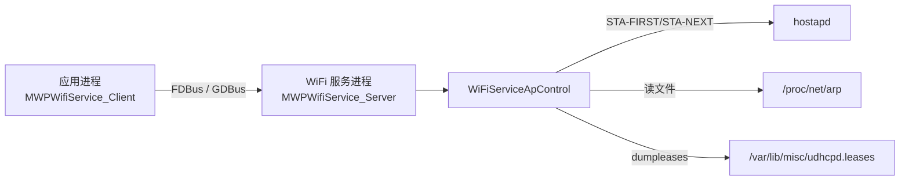
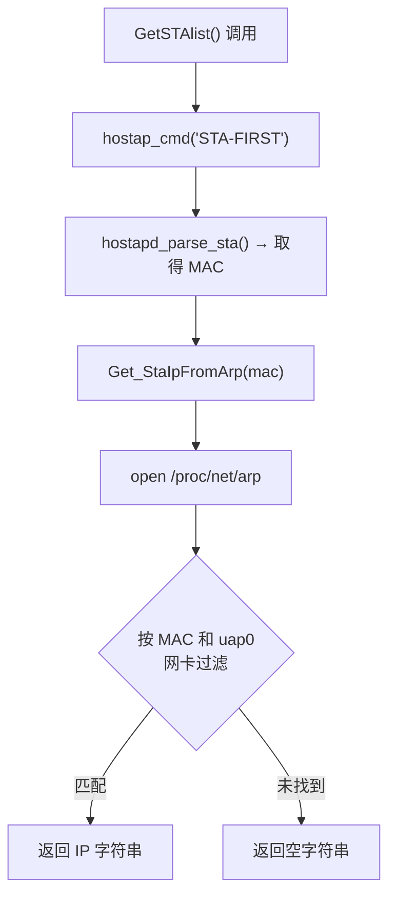
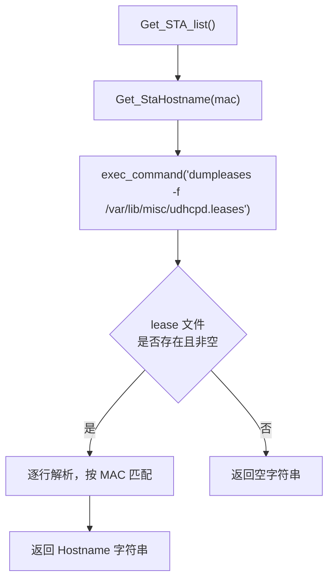
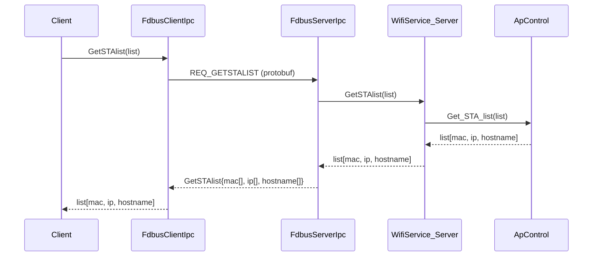
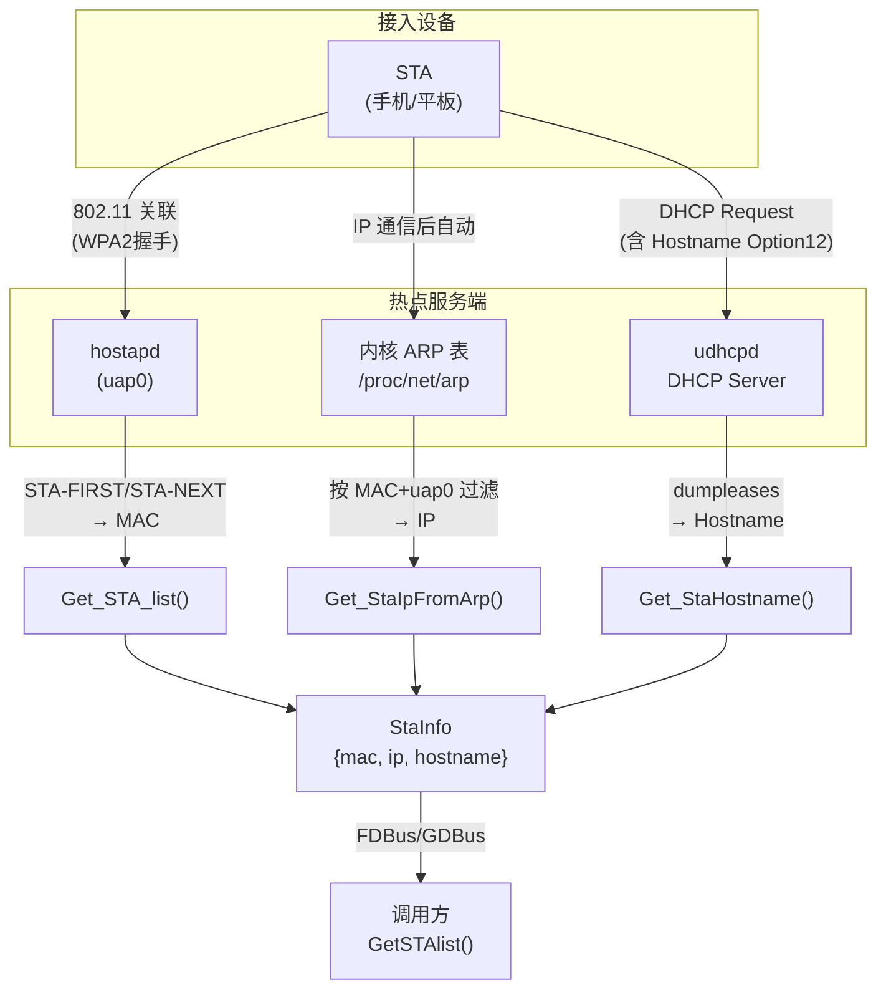
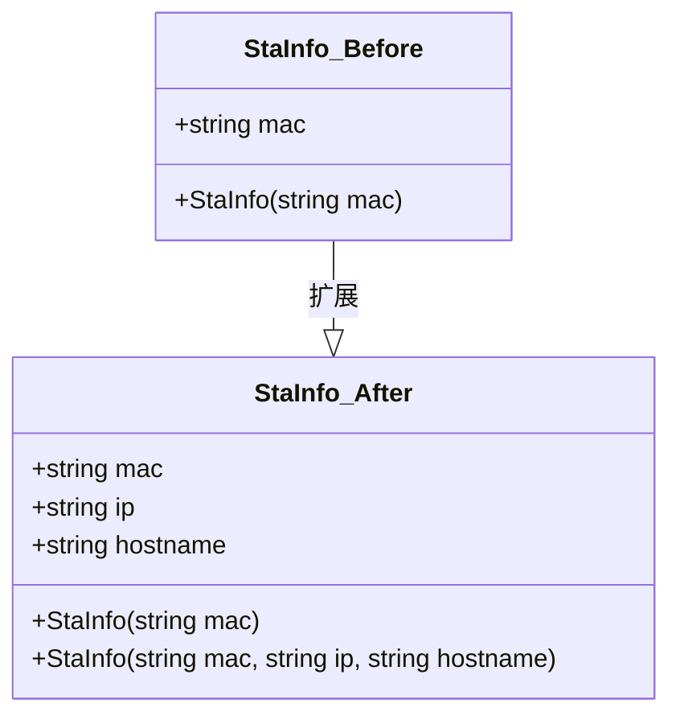

# GetSTAlist 扩展：新增 IP 地址与 Hostname 字段

---

## 1. 背景知识

### 1.1 WiFi AP（热点）模式与 STA

在车机 WiFi 服务中，设备可以开启 **AP（Access Point）热点**模式，允许外部设备（手机、平板等）以 **STA（Station）** 身份接入。

- **hostapd**：运行于 `uap0` 网卡，负责处理 802.11 无线关联、认证（WPA2 握手）等。通过 Unix Domain Socket（`/var/run/hostapd/uap0`）提供控制接口，可查询已关联的 STA 列表。
- **udhcpd**：BusyBox 提供的轻量 DHCP 服务器，为接入的 STA 分配 IP 地址，并记录 lease（租约）信息到文件。
- **uap0**：热点对应的虚拟网卡，gateway IP 为 `192.168.50.1`，DHCP 地址池为 `192.168.50.2~192.168.50.100`。

### 1.2 原有 StaInfo 结构体

改动前，公开 API 返回的 `StaInfo` 仅包含 MAC 地址：

```cpp
// include/wifi/MWPWifiType.h
struct StaInfo {
    std::string mac;
};
```

公开接口为：

```cpp
// include/wifi/IMWPWifiService.h
virtual bool GetSTAlist(std::vector<struct StaInfo>& list) = 0;
```

### 1.3 IPC 架构

WiFi 服务采用 Client-Server 架构，支持两套 IPC 通道：



| IPC 通道 | 序列化格式 | 关键文件 |
|---------|-----------|---------|
| FDBus | Protobuf | `ipc/fdbus/protobuf/com_cvte_linux_wifi.proto` |
| GDBus | GVariant (D-Bus) | `ipc/gdbus/common/com.cvte.linux.wifi.xml` + `wifi_dbus.c` |

---

## 2. 问题描述

### 现象

调用 `GetSTAlist()` 时，仅能获取到已连接 STA 的 MAC 地址，无法得到：

- **IP 地址**（用于网络通信、设备识别）
- **设备名称 Hostname**（用于 UI 展示、用户识别）

### 需求

在热点场景下，需要完整的 STA 信息以支持连接设备管理功能：展示已连接设备的名称和 IP，或对特定设备执行操作。

---

## 3. 代码路径分析

### 3.1 IP 地址获取路径

IP 地址来自内核 ARP 表（`/proc/net/arp`），在 STA 与热点通信后内核自动填写，**实时更新**。



**关键实现**（`wifiservice/apctrl/MWPWiFiServiceApControl.cpp`）：

```cpp
// 新增函数：从 ARP 表按 MAC + 网卡名匹配 IP
std::string WiFiServiceApControl::Get_StaIpFromArp(const std::string& mac) {
    std::ifstream arpFile("/proc/net/arp");
    if (!arpFile.is_open()) return "";
    std::string line;
    std::getline(arpFile, line); // 跳过表头
    while (std::getline(arpFile, line)) {
        std::istringstream iss(line);
        std::string ip, hwtype, flags, hwaddr, mask, dev;
        iss >> ip >> hwtype >> flags >> hwaddr >> mask >> dev;
        // 过滤 uap0 网卡，大小写不敏感比较 MAC
        if (dev == m_str_network_card_name && mac_equal_ci(hwaddr, mac)) {
            return ip;
        }
    }
    return "";
}
```

`/proc/net/arp` 文件格式：
```
IP address       HW type     Flags       HW address            Mask     Device
192.168.50.2     0x1         0x2         aa:bb:cc:dd:ee:ff     *        uap0
```

### 3.2 Hostname 获取路径

Hostname 来自 udhcpd 的 lease 文件，由 DHCP DISCOVER/REQUEST 报文中的 Option 12 字段提供（客户端自报）。



**关键实现**（`wifiservice/apctrl/MWPWiFiServiceApControl.cpp`）：

```cpp
// 新增函数：从 udhcpd lease 文件按 MAC 获取 hostname
std::string WiFiServiceApControl::Get_StaHostname(const std::string& mac) {
    std::string output = exec_command("dumpleases -f /var/lib/misc/udhcpd.leases 2>/dev/null");
    if (output.empty()) return "";
    std::istringstream ss(output);
    std::string line;
    std::getline(ss, line); // 跳过表头
    while (std::getline(ss, line)) {
        std::istringstream iss(line);
        std::string lmac, lip, lhost;
        iss >> lmac >> lip >> lhost;
        if (mac_equal_ci(lmac, mac)) {
            return lhost;
        }
    }
    return "";
}
```

`dumpleases` 输出格式：
```
Mac Address        IP Address      Hostname        Expires at
aa:bb:cc:dd:ee:ff  192.168.50.2   android-phone   Thu Jan  1 00:02:24 1970
```

### 3.3 Get_STA_list 更新（串联两路数据）

```cpp
// wifiservice/apctrl/MWPWiFiServiceApControl.cpp
while (hostapd_parse_sta(reply, list))
{
    auto& sta = list.back();
    sta.ip       = Get_StaIpFromArp(sta.mac);   // 实时 ARP 查询
    sta.hostname = Get_StaHostname(sta.mac);     // lease 文件查询
    std::string cmd = "STA-NEXT ";
    cmd += sta.mac;
    ret = hostap_cmd(cmd, &reply);
    if (ret < 0) return false;
}
```

### 3.4 FDBus 序列化层调用链



---

## 4. 根本原因

### 直接原因

原始 `StaInfo` 结构体只定义了 `mac` 字段，且 `Get_STA_list()` 仅通过 hostapd 的 `STA-FIRST/STA-NEXT` 命令获取 MAC，未对接其他数据源。

### 深层原因

hostapd 的 `STA` 命令返回的信息不包含 IP 地址（IP 地址由 DHCP 层管理，hostapd 无感知）。IP 和 Hostname 分属两个不同子系统：

| 字段 | 来源子系统 | 刷新机制 |
|------|----------|---------|
| MAC | hostapd（802.11 关联） | STA 关联/解关联时变化 |
| IP | 内核 ARP 表 | STA 有 IP 通信后自动填写，实时 |
| Hostname | udhcpd DHCP lease | STA 发起 DHCP 请求时写入 |

---

## 5. 触发场景

| 场景名称 | 描述 | 字段可用性 |
|---------|------|-----------|
| STA 刚关联，尚未获取 IP | STA 完成 802.11 关联但 DHCP 未完成 | MAC ✅, IP ❌, Hostname ❌ |
| STA 完成 DHCP，首次获 IP | udhcpd 分配地址，ARP 表已有记录 | MAC ✅, IP ✅, Hostname ⚠️（lease 文件10s内刷新） |
| STA 正常使用中 | ARP 表有效，lease 文件已写出 | MAC ✅, IP ✅, Hostname ✅ |
| STA 未上报 Hostname | 部分设备 DHCP 请求不携带 Option 12 | MAC ✅, IP ✅, Hostname ❌（返回空） |
| lease 文件不存在 | udhcpd 尚未写出文件（首次启动 <10s） | MAC ✅, IP ✅, Hostname ❌ |

---

## 6. 排查步骤

### 6.1 验证 ARP 表

确认 STA 关联后内核 ARP 表有对应条目：

```bash
cat /proc/net/arp
# 期望看到类似：
# 192.168.50.2   0x1  0x2  aa:bb:cc:dd:ee:ff  *  uap0
```

若无条目：STA 可能未完成 DHCP 或未发送任何 IP 报文。

### 6.2 验证 lease 文件

```bash
ls -la /var/lib/misc/udhcpd.leases
dumpleases -f /var/lib/misc/udhcpd.leases
```

- 若文件不存在：检查 `udhcpd.conf` 中 `lease_file` 和 `auto_time` 是否已取消注释。
- 若文件存在但无对应 STA：等待 `auto_time`（10s）写入周期，或 STA 重新发起 DHCP 请求。

### 6.3 查看 udhcpd 进程与配置

```bash
ps aux | grep udhcpd
cat /app/etc/udhcpd.conf | grep -E "lease_file|auto_time"
```

期望输出：
```
lease_file  /var/lib/misc/udhcpd.leases
auto_time   10
```

### 6.4 通过 test 工具验证接口

```bash
# 在 test 工具中执行
Get_STAlist
# 期望日志：
# sta mac:aa:bb:cc:dd:ee:ff ip:192.168.50.2 hostname:android-phone
```

### 6.5 日志关键字过滤

```bash
logcat | grep "WiFiServiceApControl"
```

---

## 7. 修复建议

### 已完成改动汇总

| 文件 | 改动内容 |
|------|---------|
| `conf/udhcpd.conf` | 取消 `lease_file` 和 `auto_time 10` 注释，启用 lease 文件定时写出 |
| `include/wifi/MWPWifiType.h` | `StaInfo` 新增 `ip`、`hostname` 字段，新增三参数构造函数 |
| `wifiservice/apctrl/MWPWiFiServiceApControl.h` | 声明 `Get_StaIpFromArp()`、`Get_StaHostname()` |
| `wifiservice/apctrl/MWPWiFiServiceApControl.cpp` | 实现两个查询函数，更新 `Get_STA_list()` 填充新字段 |
| `ipc/fdbus/protobuf/com_cvte_linux_wifi.proto` | `GetSTAlist` message 新增 `repeated string ip/hostname` |
| `ipc/fdbus/server/MWPWifiFdbusServerIpc.cpp` | 序列化 ip/hostname 到 protobuf |
| `ipc/fdbus/client/MWPWifiFdbusClientIpc.cpp` | 从 protobuf 反序列化 ip/hostname |
| `ipc/gdbus/common/com.cvte.linux.wifi.xml` | GetSTAlist 方法新增 ip/hostname 出参 |
| `ipc/gdbus/common/wifi_dbus.c` | 更新 ArgInfo、finish/sync/complete 函数签名与 GVariant 格式串 |
| `ipc/gdbus/common/wifi_dbus.h` | 更新三个函数声明 |
| `ipc/gdbus/server/MWPWifiServiceServerIpcGdbusImpl.cpp` | 序列化 ip/hostname 到 GVariant |
| `ipc/gdbus/client/MWPWifiServiceClientIpcGdbusImpl.cpp` | 从 GVariant 反序列化 ip/hostname |
| `test/MWPWifiTest.cpp` | 日志输出新增 ip 和 hostname 字段 |

### 注意事项

1. **proto 文件需重新编译生成 `.pb.h/.pb.cc`**，确保 FDBus 序列化代码与新字段同步。
2. **`wifi_dbus.c` 为手动更新的生成代码**，如后续重新执行 `gdbus-codegen`，需将本次改动同步合并。
3. **Hostname 有约 10 秒延迟**：由 `auto_time 10` 决定。若需即时获取，可考虑配置 `notify_file` 脚本在 lease 变化时主动触发写出。
4. **部分设备不发送 Hostname**：`hostname` 字段返回空字符串为正常现象，调用方需做判空处理。

---

## 8. 架构与流程图

### 完整数据流（StaInfo 三字段来源）



### StaInfo 结构体演变


