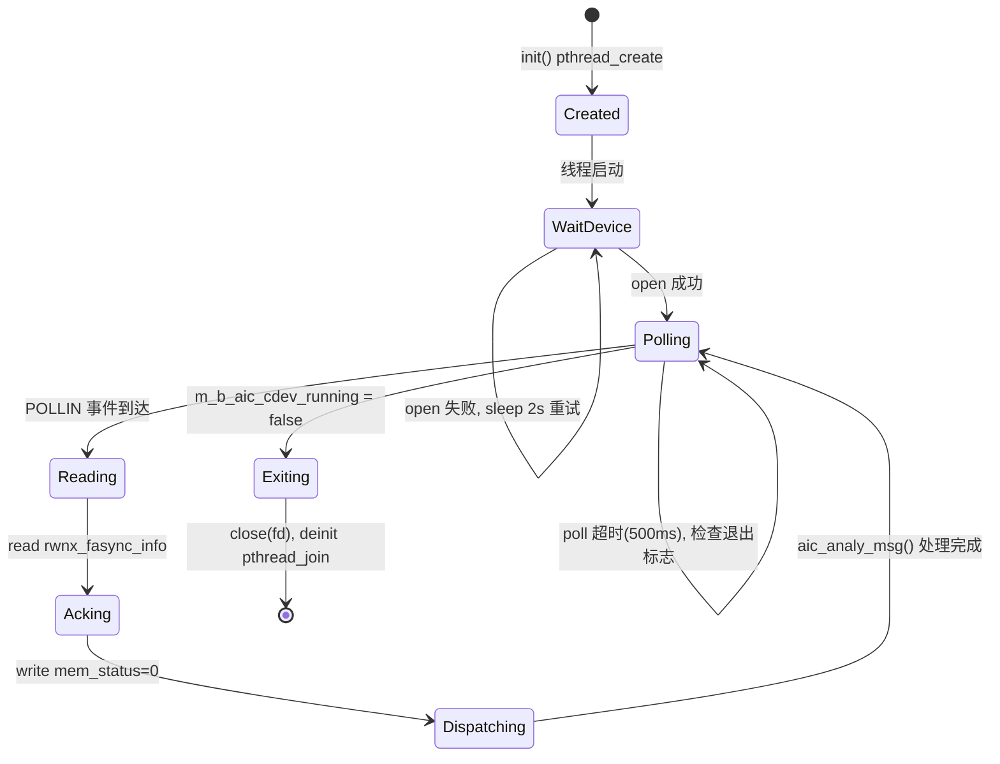
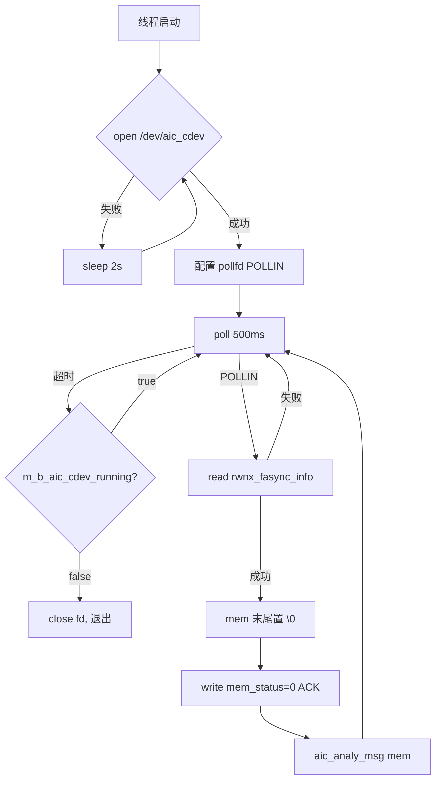
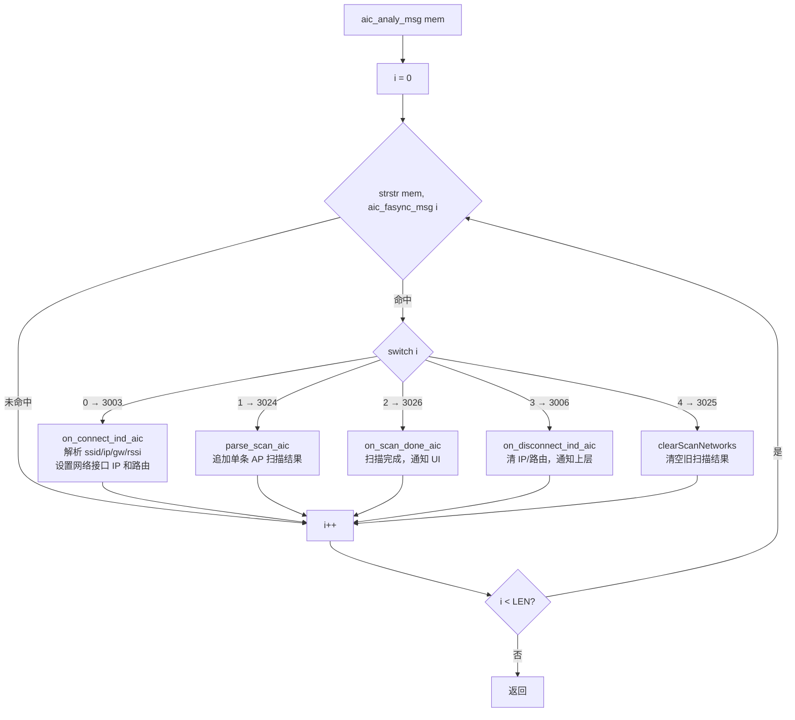
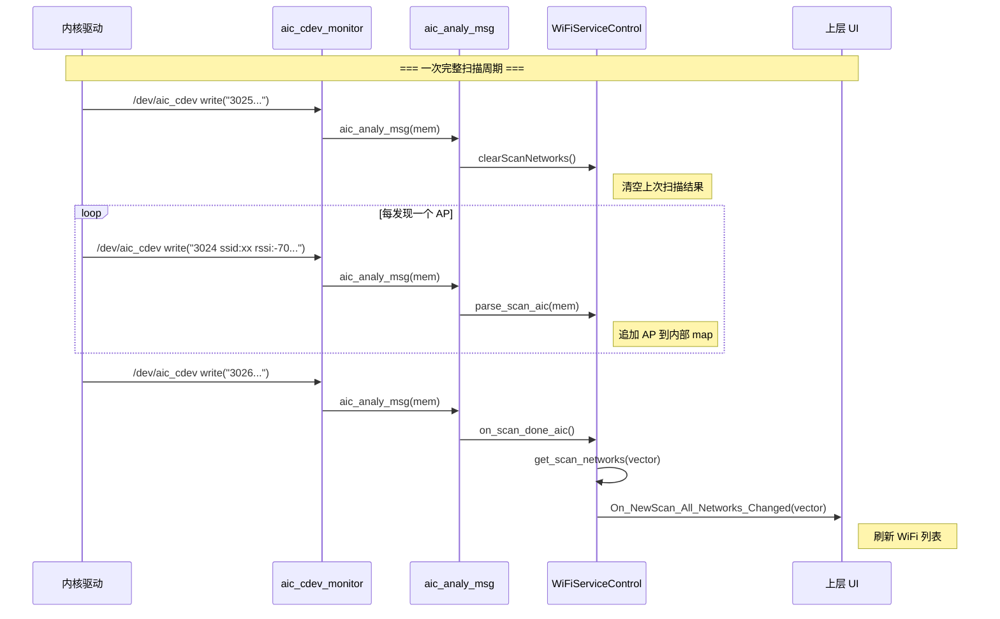
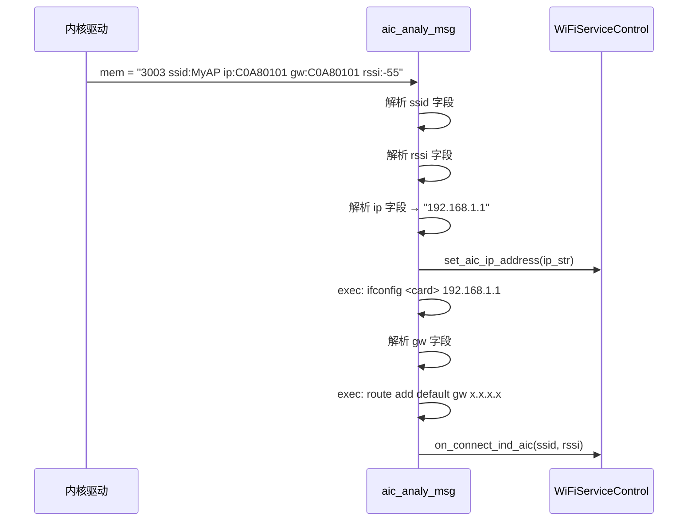
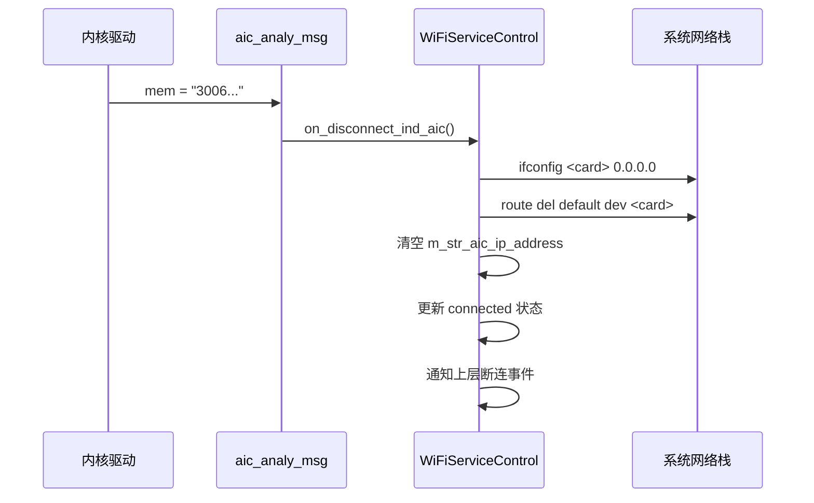

# AIC WiFi 事件通路模块分析

> [!info] 阅读背景
> 本文基于 `wifiservice/wifictrl/MWPWiFiServiceControl.cpp` 源码，分析 AIC WiFi 芯片事件通路的完整架构，包括内核驱动与用户态服务之间的通信机制、`aic_cdev_monitor` 监听线程的设计、事件分发流程，以及扫描、连接、断连三大核心流程的时序关系。

---

## 1. 模块概述

### 1.1 在系统中的位置

```
AIC 芯片固件
     │  异步事件上报
     ▼
内核驱动 (rwnx / aic 驱动模块)
     │  写入 /dev/aic_cdev
     ▼
aic_cdev_monitor 线程          ← 本模块
     │  解析 + 分发
     ▼
WiFiServiceControl 业务逻辑
     │  回调
     ▼
上层 UI / HMI
```

### 1.2 与其他模块的关系

| 方向 | 模块 | 交互方式 |
|------|------|---------|
| 下游（数据来源） | 内核 AIC 驱动 | `poll` + `read` `/dev/aic_cdev`，读后回写 ACK |
| 上游（事件消费） | `WiFiServiceControl` | 直接调用成员函数（`on_connect_ind_aic` 等）|
| 最终回调 | UI / HMI 层 | `m_ptr_wifi_callback->On_NewScan_All_Networks_Changed()` 等 |

---

## 2. 关键数据结构

### 2.1 事件数据包

内核驱动每次上报一个事件，封装为固定大小的结构体：

```cpp
// MWPWiFiServiceControl.cpp:1555
#define AIC_CDEV_BUF_MAX  256

struct rwnx_fasync_info {
    int  mem_status;          // 状态标志：非 0 表示有新数据，处理完须写回 0 作为 ACK
    char mem[AIC_CDEV_BUF_MAX]; // 事件文本内容，最大 256 字节
};
```

`mem` 字段为**纯文本格式**，通过嵌入特定命令字符串来标识事件类型，并携带参数（ssid、ip、rssi 等）。

### 2.2 事件消息协议

用户态通过 `strstr()` 对 `mem` 进行**子串匹配**来识别事件类型：

```cpp
// MWPWiFiServiceControl.cpp:1534
#define AIC_FASYNC_MSG_LEN  5

static const char *aic_fasync_msg[AIC_FASYNC_MSG_LEN] = {
    "3003",   // [0] CUST_CMD_CONNECT_IND      — 连接成功
    "3024",   // [1] CUST_CMD_SCAN_IND         — 单条扫描结果
    "3026",   // [2] CUST_CMD_SCAN_DONE_IND    — 扫描完成
    "3006",   // [3] CUST_CMD_DISCONNECT_IND   — 断连
    "3025",   // [4] CUST_CMD_SCAN_START_IND   — 扫描开始
};
```

各事件携带的典型参数：

| 命令字 | 事件 | 携带参数 |
|--------|------|---------|
| `3003` | 连接成功 | `ssid:<名称>`, `ip:<十六进制>`, `gw:<十六进制>`, `rssi:<值>` |
| `3024` | 单条扫描结果 | AP 信息（SSID、RSSI、安全类型等）|
| `3026` | 扫描完成 | 无额外参数 |
| `3006` | 断连 | 无额外参数 |
| `3025` | 扫描开始 | 无额外参数 |

---

## 3. aic_cdev_monitor 线程详解

### 3.1 生命周期



### 3.2 线程主循环流程



### 3.3 关键实现细节

**设备打开重试**（等待驱动加载就绪）：
```cpp
// MWPWiFiServiceControl.cpp:2192
while (self->m_b_aic_cdev_running && fd < 0) {
    fd = open(dev_path, O_RDWR);
    if (fd < 0) {
        MWP_INFO("aic_cdev_monitor: waiting for %s...", dev_path);
        usleep(2000000);  // 2s 间隔重试
    }
}
```

**poll 超时设计**（支持干净退出）：
```cpp
// MWPWiFiServiceControl.cpp:2205
int rc = poll(&pfd, 1, 500);  // 500ms 超时，不阻塞在 read
if (rc == 0) continue;        // 超时则检查 m_b_aic_cdev_running
```

**ACK 机制**（通知内核释放缓冲区）：
```cpp
// MWPWiFiServiceControl.cpp:2229
fsy_info->mem_status = 0;
ret = write(fd, &fsy_info->mem_status, sizeof(fsy_info->mem_status));
```

---

## 4. 事件分发：aic_analy_msg

`aic_analy_msg` 是 `aic_cdev_monitor` 调用的解析函数，遍历所有已注册的命令字，对每条收到的 `mem` 逐一匹配，命中后跳转到对应 case 处理。



> **注意**：遍历不会在第一个命中后停止，一条 `mem` 可能命中多个命令字（取决于文本内容）。

---

## 5. 完整扫描流程

WiFi 扫描涉及三类事件的协作，完整时序如下：



---

## 6. 连接与断连流程

### 6.1 连接成功（3003 CONNECT_IND）



**ip/gw 字段格式**：小端十六进制，`AIC_WLAN_SET_LEN=8` 个十六进制字符，解析代码：
```cpp
// MWPWiFiServiceControl.cpp:2110
unsigned int ip = aic_str2uint(hex_buf);
snprintf(ip_str, sizeof(ip_str), "%u.%u.%u.%u",
    (ip >>  0) & 0xFF, (ip >>  8) & 0xFF,
    (ip >> 16) & 0xFF, (ip >> 24) & 0xFF);
```

### 6.2 断连（3006 DISCONNECT_IND）



---

## 7. 线程启停管理

```cpp
// 启动 — init() MWPWiFiServiceControl.cpp:1599
m_b_aic_cdev_running = true;
pthread_create(&m_aic_cdev_thread_id, nullptr, aic_cdev_monitor, this);

// 停止 — deinit() MWPWiFiServiceControl.cpp:1617
m_b_aic_cdev_running = false;
pthread_join(m_aic_cdev_thread_id, nullptr);  // 等待线程自然退出
m_aic_cdev_thread_id = 0;
```

退出流程依赖 poll 的 500ms 超时窗口：`deinit()` 设置标志后，最多等待 500ms 线程检测到标志并退出，`pthread_join` 保证无资源泄漏。

---

## 8. 设计小结

| 设计点 | 实现方式 | 目的 |
|--------|---------|------|
| 异步事件接收 | 独立线程 + `poll` | 不阻塞主业务线程 |
| 设备未就绪处理 | 循环重试 `open`，2s 间隔 | 驱动延迟加载时不崩溃 |
| 干净退出 | `poll` 500ms 超时 + 布尔标志 | 避免永久阻塞，`pthread_join` 可正常返回 |
| 内核缓冲区同步 | 处理完写回 `mem_status=0` | ACK 机制，防止内核缓冲区堆积 |
| 事件识别 | `strstr` 子串匹配 | 简单灵活，适配文本格式协议 |
| 事件分发 | 数组索引 + `switch-case` | 便于扩展，新增事件只需追加数组条目和 case |
