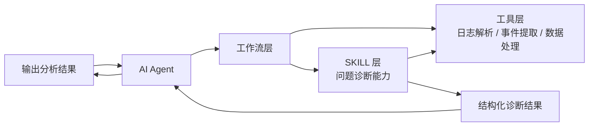

```mermaid
flowchart LR

User[用户输入问题] --> Agent[AI Agent]

Agent --> Workflow[工作流层]

Workflow --> Tools[工具层<br/>日志解析 / 事件提取 / 数据处理]
Workflow --> Skills[SKILL 层<br/>问题诊断能力]

Skills --> Tools
Skills --> Result[结构化诊断结果]

Result --> Agent
Agent --> User[输出分析结果]
```