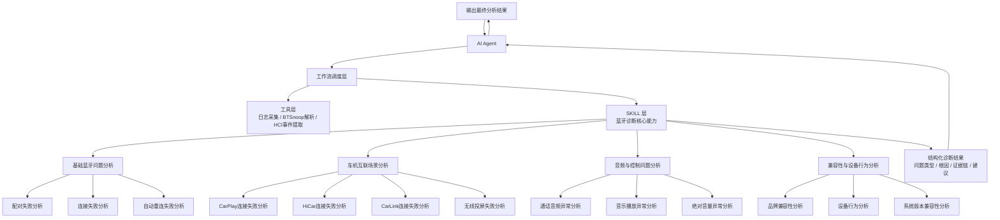

```mermaid
flowchart TB

User[用户问题] --> Agent[AI Agent]

Agent --> Workflow[工作流调度层]

Workflow --> Tools[工具层<br/>日志采集 / BTSnoop解析 / HCI事件提取]

Workflow --> SkillLayer[SKILL 层<br/>蓝牙诊断核心能力]

SkillLayer --> BasicSkills[基础蓝牙问题分析]
SkillLayer --> InterconnectSkills[车机互联场景分析]
SkillLayer --> AudioSkills[音频与控制问题分析]
SkillLayer --> CompatibilitySkills[兼容性与设备行为分析]

BasicSkills --> Pairing[配对失败分析]
BasicSkills --> Connection[连接失败分析]
BasicSkills --> Reconnect[自动重连失败分析]

InterconnectSkills --> CarPlay[CarPlay连接失败分析]
InterconnectSkills --> HiCar[HiCar连接失败分析]
InterconnectSkills --> CarLink[CarLink连接失败分析]
InterconnectSkills --> Projection[无线投屏失败分析]

AudioSkills --> HFP[通话音频异常分析]
AudioSkills --> A2DP[音乐播放异常分析]
AudioSkills --> Volume[绝对音量异常分析]

CompatibilitySkills --> Brand[品牌兼容性分析]
CompatibilitySkills --> Device[设备行为分析]
CompatibilitySkills --> Version[系统版本兼容性分析]

SkillLayer --> Result[结构化诊断结果<br/>问题类型 / 根因 / 证据链 / 建议]

Result --> Agent
Agent --> User[输出最终分析结果]
```