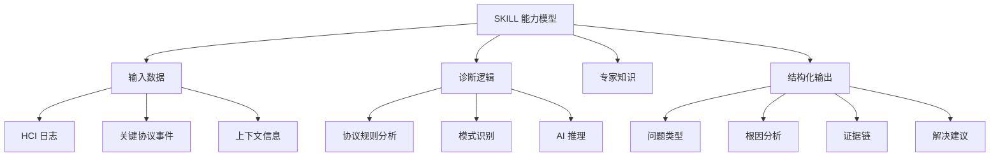

```mermaid
flowchart TB

Skill[SKILL 能力模型]

Skill --> Input[输入数据]
Skill --> Logic[诊断逻辑]
Skill --> Knowledge[专家知识]
Skill --> Output[结构化输出]

Input --> HCI[HCI 日志]
Input --> Events[关键协议事件]
Input --> Context[上下文信息]

Logic --> Rules[协议规则分析]
Logic --> Pattern[模式识别]
Logic --> Reasoning[AI 推理]

Output --> Problem[问题类型]
Output --> RootCause[根因分析]
Output --> Evidence[证据链]
Output --> Suggestion[解决建议]
```